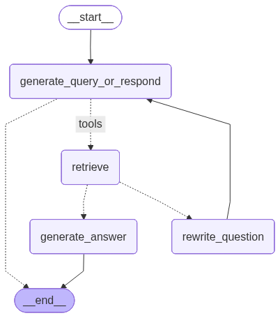
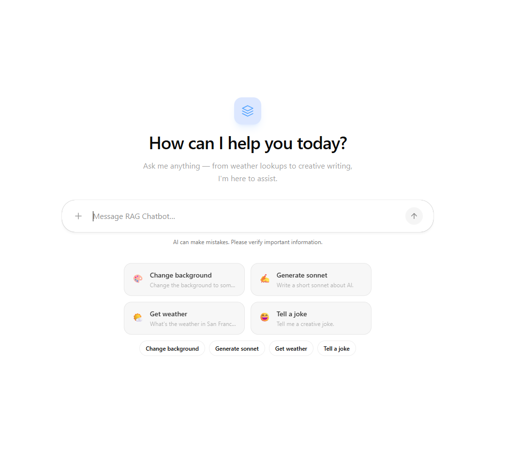

# RAG-Chatbot

An Agentic Retrieval-Augmented Generation (Agentic RAG) chatbot built with LangGraph, Google Gemini, and CopilotKit.

Upload documents, ask questions in natural language, and receive context-aware answers grounded in your uploaded data.

This project implements an agentic RAG system where the agent can decide to retrieve documents, rewrite the question, or respond directly depending on the context.

---

# Features

- Document upload & processing
- Semantic search using vector embeddings
- Agentic RAG workflow
- Query rewriting & retrieval loop
- LangGraph agent workflow
- Google Gemini integration
- Interactive chat UI with CopilotKit
- FastAPI backend
- Context-aware grounded responses

---

# Agentic RAG Architecture

```text
User Question
      ↓
Generate Query or Direct Response
      ↓
Retrieve Relevant Documents
      ↓
Generate Answer
      ↓
Evaluate Retrieval Quality
      ↓
Rewrite Question (if needed)
      ↓
Retry Retrieval
      ↓
Final Grounded Response
```

---

# LangGraph Workflow 

<p align="center">
  
</p>

---

# Frontend Preview



---

# Tech Stack

## Backend
- Python
- FastAPI
- LangGraph
- LangChain
- Google Gemini
- Pydantic

## Frontend
- Next.js
- React
- CopilotKit

## Vector & Embeddings
- Google Generative AI Embeddings
- In-Memory Vector Store

---

# Project Structure

```text
RAG-Chatbot/
├── Data/
├── frontend/
├── img/
│
├── notebook/
│
├── src/
│   ├── agent.py
│   ├── config.py
│   ├── langgraph.json
│   ├── models.py
│   ├── nodes.py
│   ├── rag_pipeline.py
│   └── tools.py
│   └── .env
|
├── .gitignore
├── README.md
└── requirements.txt
```

---

# Setup

## 1. Clone Repository

```bash
git clone https://github.com/Abdoosaeid/RAG-Chatbot.git
cd RAG-Chatbot
```

---

## 2. Backend Setup

Create virtual environment:

```bash
python -m venv .venv
```

Activate environment:

### Windows

```bash
.venv\Scripts\activate
```

### Linux / macOS

```bash
source .venv/bin/activate
```

Install dependencies:

```bash
pip install -r requirements.txt
```

---

## 3. Frontend Setup

```bash
cd frontend
npm install
```

---

# Environment Variables

Create a `.env` file in the root directory:

```env
GOOGLE_API_KEY=your_google_api_key

# Optional: LangSmith tracing
LANGCHAIN_API_KEY=your_langsmith_api_key
LANGCHAIN_TRACING_V2=true
LANGCHAIN_PROJECT=RAG-Chatbot
```

---

# Running the Project

## Run Backend

```bash
cd src
uv run agent.py
```

Backend server:

```text
http://localhost:8123
```

---

## Run Frontend

```bash
cd frontend
npm run dev
```

Frontend application:

```text
http://localhost:3000
```

---

# How It Works

1. User uploads documents
2. Text is extracted and chunked
3. Chunks are converted into embeddings
4. Embeddings are stored in a vector database
5. User asks a question
6. The agent decides whether to retrieve or respond directly
7. Relevant documents are retrieved
8. Gemini generates a grounded answer
9. If retrieval quality is poor, the agent rewrites the question
10. The retrieval process runs again until a good response is generated

---

# Future Improvements

- Persistent vector database
- Streaming responses
- Multi-file support
- Chat history memory
- Hybrid search
- Re-ranking pipeline
- Authentication system
- Docker deployment
- Monitoring & observability

---

# License

MIT